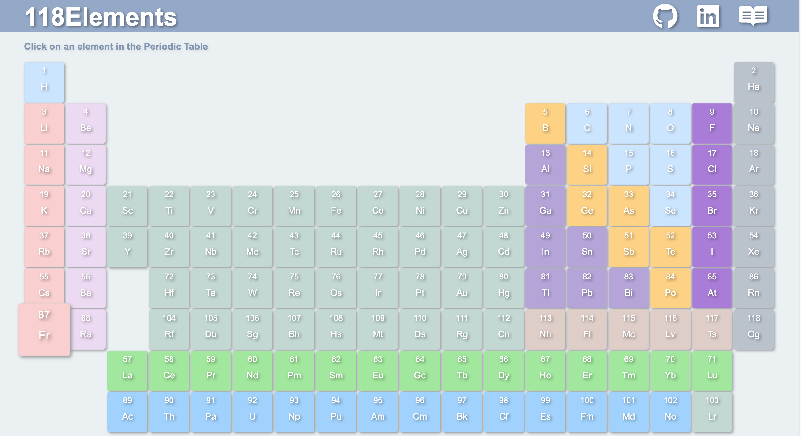
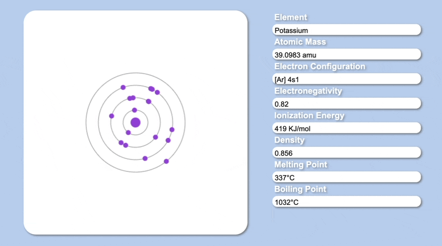
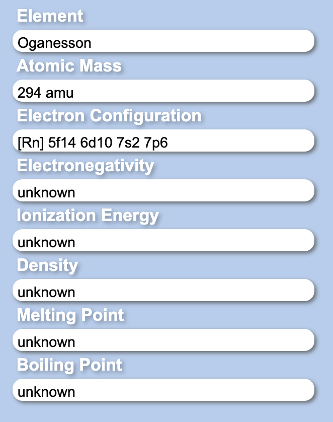
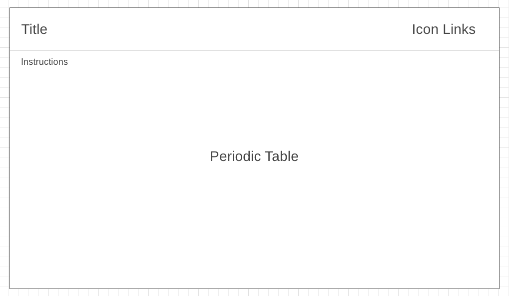
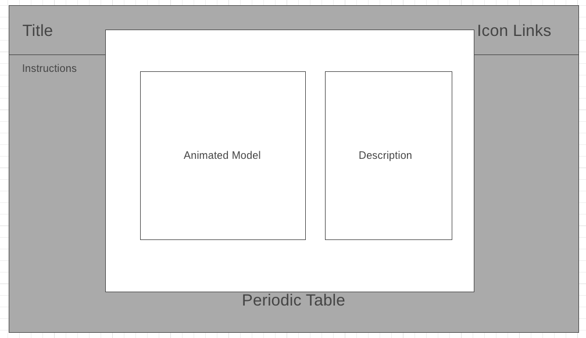

# 118Elements

[118Elements](https://bonnieli51.github.io/JavaScript-Project/) is a 2D data visualization web app that allows users to view an element's atomic model and description. When users enter the web app, they are presented with a periodic table that have clickable elements cells. When the element is selected from the periodic table, its data will be fetched nto render an animated atomic model and description of the respective element. The goal of this project is to allow users to have a better visualization of electrons orbiting the nucleus.



## Functionality & MVPs
With 118Elements, users will be able to:
* Choose any of the 118 elements on the periodic table via the cells of the periodic table. 118Elements will fetch data of the specific element based on its atomic number in the database. The data will be organized and used to make the animated Bohr's atomic model of the element and its description.  


Oganesson


<!-- 
 -->


Potassium 


* To render the periodic table, data of all elements is fetched and saved to the variable called allElements. Each row of the periodic table is iterated, based on the specific cell(element cell or empty cell) either functions makeElementdiv(i) or makeEmptycell() is called to add html elements into the table. Colors of the cells are also determined based on the element's group which is also done in the makeElementdiv funtion. 

```js
 makeElementdiv(i){

        const colors = {
            "alkali metal": "#FACFCE",
            "alkaline earth metal": "#ECD8F2",
            "halogen": "#A979D9", 
            "metal": "#B4A3D9",
            "metalloid":"#FFD37E" ,
            "nonmetal": "#CBE4FF",
            "noble gas": "#B9C2CC",
            "post-transition metal": "#dfcdc6",
            "transition metal": "#c2d8d3",
            "lanthanoid": "#9FE89A",
            "actinoid": "#9ED1FF"
        }

        const div = document.createElement("div");
        div.classList.add("element")
        div.style.backgroundColor = colors[this.allElements[i].groupBlock]

        const atomicNum = document.createElement("div");        
        atomicNum.classList.add("atomicNum");
        atomicNum.innerHTML = this.allElements[i].atomicNumber; 

        const symbol = document.createElement("h2");
        symbol.innerHTML = this.allElements[i].symbol;
        symbol.classList.add("symbol");

        div.appendChild(atomicNum);
        div.appendChild(symbol);
        this.ele.appendChild(div);
    };

    makeEmptycell(){
        const div = document.createElement("div");
        div.classList.add("cell");
        this.ele.appendChild(div);
    }
```

* To render the animated Bohr's model, the electron configuration fetched needs to be reorganized into an an array with integers. The intergers will represent the number of electrons in a specific shell which will correspond to the index of the array. To convert from the noble gas configuration, a hash is created with noble gases as its keys and its electron configuration as its values. Data fetched will be split to an array, iterated, mutated and used to obtain the desired array of number of electrons. 

```js

    getShells(){
        const nobleGases = {
            "[He]": ['1s2'], 
            "[Ne]": ['1s2', '2s2', '2p6'], 
            "[Ar]": ['1s2', '2s2', '2p6', '3s2', '3p6'],
            "[Kr]": ['1s2', '2s2', '2p6', '3s2', '3p6', '3d10', '4s2', '4p6'],
            "[Xe]": ['1s2', '2s2', '2p6', '3s2', '3p6', '3d10', '4s2', '4p6', '4d10', '5s2', '5p6'],
            "[Rn]": ['1s2', '2s2', '2p6', '3s2', '3p6', '3d10', '4s2', '4p6', '4d10', '5s2', '5p6', '4f14', '5d10', '6s2', '6p6'], 
            "[Og]": ['1s2', '2s2', '2p6', '3s2', '3p6', '3d10', '4s2', '4p6', '4d10', '5s2', '5p6', '4f14', '5d10', '6s2', '6p6', '5f14', '6d10', '7s2', '7p6']
        };
        
        let electronConfiguration = this.data[0].electronicConfiguration.split(" ");
        
        if(Object.keys(nobleGases).includes(electronConfiguration[0])){
            let nobleGas = electronConfiguration.shift();
            electronConfiguration =  nobleGases[nobleGas].concat(electronConfiguration)
        };

        const count = {}
        electronConfiguration.forEach( (el) => {
            if(!count[el[0]]) count[el[0]] = 0;
            count[el[0]] += parseInt(el.slice(2));
        });

        return Object.values(count);
    }
```


* To animate the Bohr's atomic model, each electron, orbital and nucleus objects are created in the Model.init(). Orbitals are initialized based on its shell number and eletrons for the corresponding orbital are initilialized with a random position and velocity in the orbital. 

```js

    init(){
        this.nucleus = new Nucleus(this.ctx, this.ctx.canvas.width/2, this.ctx.canvas.height/2, 10, this.data[0].cpkHexColor, 0);
      
        this.shells.forEach( (numElectrons, shellNum) => {
            let orbitalRadius = 25 * (shellNum+1);
            this.oribitals.push(new Orbital(this.ctx, this.ctx.canvas.width/2, this.ctx.canvas.height/2, orbitalRadius, "#808080", 0));
            
            for (let i = 0 ; i < numElectrons; i++){
                let radian = this.getRandomArbitrary(0, 6.283);
                let velocity = this.getRandomArbitrary(0.006, 0.01);
                this.electrons.push(new Electron(this.ctx, this.ctx.canvas.width/2 + Math.sin(radian) * orbitalRadius, this.ctx.canvas.width/2 + Math.cos(radian) * orbitalRadius, 5, this.data[0].cpkHexColor, velocity, orbitalRadius, radian));
            }         
        })
    }
```

## Technologies, Libraries, APIs
* Vanilla Javascript: for handling buttons, toggles
* Canvas API: to render the models 
* Webpack: to bundle and transpile the source JavaScript code


## Wireframe


 
## Implementation Timeline 
* Friday & Weekend: Create the layout of the page and the periodic table. Research APIs. 
* Monday: Hopefully have a working finished periodic table so I can start on the models.
* Tuesday: Create models and add elements description.
* Wednesday: Finish the right side and polish. 
* Thursday Morning: Finish the project and celebrate. 
